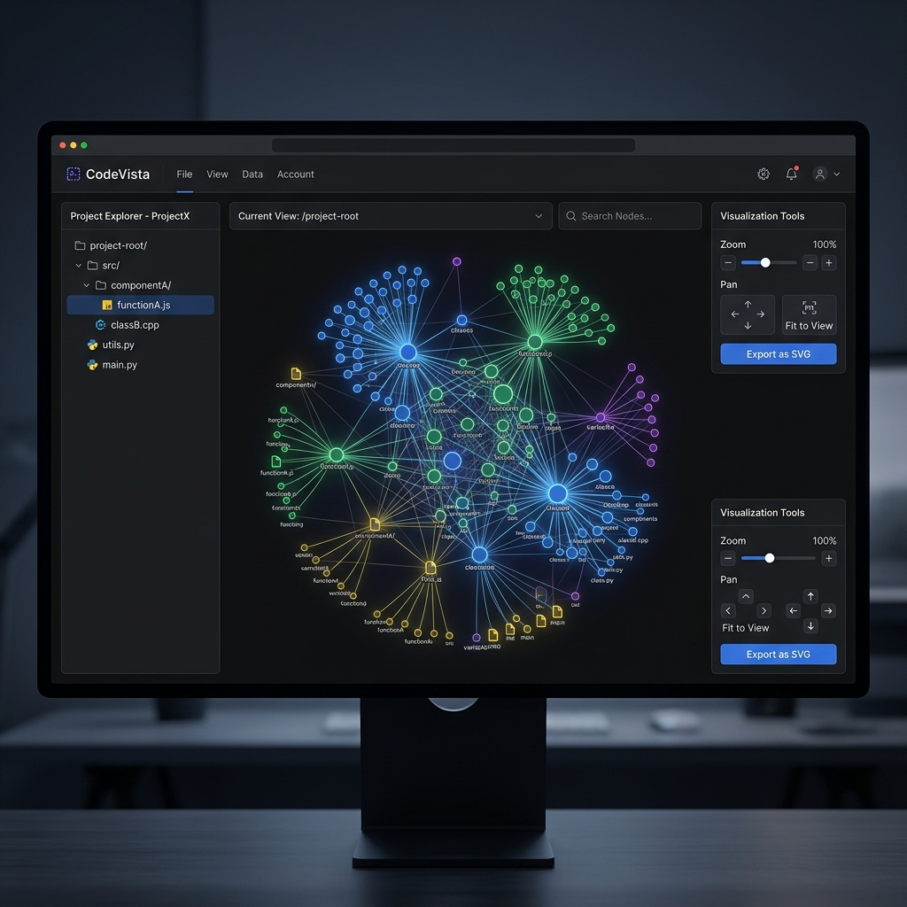

# CodeVista ???

<div align="center">

[](https://github.com/Luv-Goel/CodeVista/actions/workflows/ci.yml)
[]()
[]()
[]()
[]()
[]()
[]()
[]()
[](LICENSE)

**? AI-powered code visualizer ?**

[Visit the Live Demo on GitHub Pages](https://Luv-Goel.github.io/CodeVista/)



Transform any codebase into a stunning, interactive visual mind map. CodeVista parses your project's AST (Abstract Syntax Tree), extracts dependencies, and renders them as a real-time force-directed graph using D3.js. 

Integrated with an AI layer to provide intelligent code pattern analysis on top of the graph! ??

</div>

---

## Detailed Documentation

CodeVista is designed to help developers comprehend large codebases rapidly by rendering their Abstract Syntax Trees (ASTs) and dependency graphs interactively. Below is the detailed documentation of how the platform operates under the hood, how to deploy it, and how to utilize it effectively.

### System Architecture

The core of CodeVista operates in three distinct phases:

1. **AST Parsing & Traversal:**
   The codebase is recursively traversed using glob patterns. Files are read and passed to `@babel/parser` which parses modern JavaScript, TypeScript, and JSX/TSX into an Abstract Syntax Tree.
   
2. **Graph Construction:**
   From the ASTs, the `Graph Builder` extracts ES6 `import`/`export` statements, CommonJS `require` calls, and dynamic imports. Files and modules become **nodes**, and their dependency relationships become **edges**.

3. **Interactive Visualization:**
   The structured node-edge data is passed to a high-performance **D3.js** force-directed simulation. This simulation maps the data into a 2D physical space, applying gravitational and repulsive forces to automatically organize the code structure logically.

```mermaid
flowchart TD
    A[Your Codebase] --> B(AST Parser & File Walker)
    B -->|@babel/parser| C{Graph Builder}
    C -->|Nodes & Edges| D[D3.js Force Graph]
    D <-->|Insights| E[AI Service API]
    D --> F((Interactive Visual))
    
    style A fill:#f9f,stroke:#333,stroke-width:2px
    style D fill:#bbf,stroke:#f66,stroke-width:2px,color:#fff,stroke-dasharray: 5 5
    style F fill:#9f9,stroke:#333,stroke-width:4px
```

---

## Features

- ?? **Force-directed graph** - Interactive D3.js visualization of codebase structure
- ??? **Zoom & pan** - Smooth navigation through large code graphs
- ?? **Node selection** - Click to inspect any file or module
- ??? **Smart icons** - Visual indicators for file types (components, utils, hooks, etc.)
- ?? **File system walker** - Glob pattern support for any project structure
- ?? **AI analysis** - OpenRouter integration for intelligent code insights
- ?? **Export as SVG** - Save your interactive architecture diagrams directly to your disk
- ?? **Real-time updates** - State management with Zustand
- ?? **Beautiful UI** - Modern React with TypeScript type safety
- ?? **Docker support** - Ready-to-deploy container image

## Tech Stack

| Layer | Technology |
|-------|------------|
| Frontend | React 18, TypeScript 5 |
| Visualization | D3.js (force simulation) |
| Build | Vite 5 |
| State | Zustand |
| AI | OpenRouter API |
| Styling | CSS Modules |
| Container | Docker + Nginx |

## Quick Start

```bash
# Clone and install
git clone https://github.com/Luv-Goel/CodeVista.git
cd CodeVista
npm install

# Start development server
npm run dev

# Build for production
npm run build
```

## Deployment Options

### Docker (recommended)

The Docker image serves the production build via Nginx with Gzip compression, Security headers (CSP, XSS protection), SPA routing support, and Static asset caching.

```bash
# Build the image
docker build -t codevista .

# Run the container
docker run -d -p 8080:80 --name codevista-app codevista
```

### Vercel

[](https://vercel.com/new?project-name=codevista&repository-url=https%3A%2F%2Fgithub.com%2FLuv-Goel%2FCodeVista)

1. Push the repo to GitHub
2. Import to Vercel
3. Set build command: `npm run build`
4. Set output directory: `dist`

### Netlify

[](https://app.netlify.com/start/deploy?repository=https://github.com/Luv-Goel/CodeVista)

1. Connect your GitHub repo to Netlify
2. Build command: `npm run build`
3. Publish directory: `dist`
4. Add redirect rule: `/* /index.html 200` (for SPA routing)

### Static Hosting

Any static file host works with the `dist/` folder:

```bash
npm run build
# Deploy the dist/ folder to your host of choice
```

## Project Structure

```text
CodeVista/
|-- src/
|   |-- components/       # React components
|   |   |-- CodeVisualizer/
|   |   |-- ControlPanel/
|   |   |-- NodeInspector/
|   |   |-- VisualizationCanvas/
|   |-- services/         # Business logic
|   |   |-- astParser.ts   # @babel/parser wrapper
|   |   |-- fileWalker.ts  # File system traversal
|   |   |-- aiService.ts   # OpenRouter API client
|   |-- stores/           # Zustand state stores
|   |-- types/            # TypeScript type definitions
|   |-- __tests__/        # Component tests
|   |-- App.tsx           # Main application
|   |-- App.css           # Application styles
|   |-- index.css         # Global styles
|   |-- main.tsx          # Entry point
|-- public/
|-- dist/                 # Production build output
|-- Dockerfile            # Multi-stage Docker build
|-- nginx.conf            # Nginx configuration for Docker
|-- index.html
|-- package.json
|-- tsconfig.json
|-- vite.config.ts
|-- jest.config.js
```

## Usage

1. **Start the app** - `npm run dev` opens the visualizer
2. **Point to a codebase** - Enter a local path or GitHub URL
3. **Explore the graph** - Pan, zoom, click nodes to inspect
4. **AI insights** - Let AI analyze code patterns and dependencies
5. **Export Diagrams** - Download SVG graphs from the control panel for architectural planning

## Documentation

- [Architecture](docs/architecture.md) - Detailed architecture overview
- [Screenshots](docs/screenshots.md) - UI screenshots
- [Contributing](CONTRIBUTING.md) - How to contribute
- [Changelog](CHANGELOG.md) - Release history
- [Security](SECURITY.md) - Security policy

## License

MIT - see [LICENSE](LICENSE).

---

<div align="center">
  <sub>Built by the CodeVista Team</sub>
</div>
